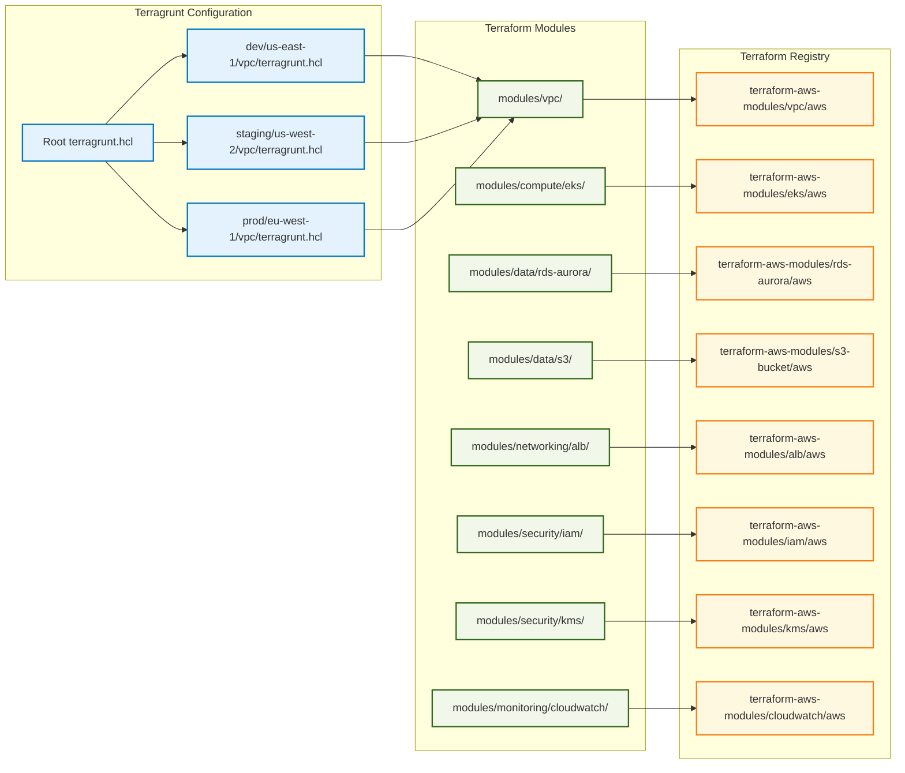

# Terragrunt AWS Infrastructure Diagram

This diagram shows the complete multi-region infrastructure architecture deployed by the terragrunt-aws project.

## Architecture Overview

```mermaid
graph TB
    %% CI/CD Pipeline
    subgraph "CI/CD Pipeline"
        GH[GitHub Repository]
        GA[GitHub Actions]
        TF[Terragrunt/Terraform]
    end

    %% Multi-Region Architecture
    subgraph "AWS Multi-Region Infrastructure"
        
        %% US East 1 - Dev Environment
        subgraph "us-east-1 (Dev Environment)"
            VPC1[VPC: 10.2.0.0/16]
            subgraph "Public Subnets"
                PUB1A[Public Subnet 1A]
                PUB1B[Public Subnet 1B]
                PUB1C[Public Subnet 1C]
            end
            subgraph "Private Subnets"
                PRIV1A[Private Subnet 1A]
                PRIV1B[Private Subnet 1B]
                PRIV1C[Private Subnet 1C]
            end
            
            %% Dev Resources
            IGW1[Internet Gateway]
            NAT1[NAT Gateway]
            ALB1[Application Load Balancer]
            EKS1[EKS Cluster]
            RDS1[RDS Aurora]
            S3_DEV[S3 Buckets]
            KMS1[KMS Keys]
            CW1[CloudWatch]
        end

        %% US West 2 - Staging Environment
        subgraph "us-west-2 (Staging Environment)"
            VPC2[VPC: 10.2.0.0/16]
            subgraph "Public Subnets 2"
                PUB2A[Public Subnet 2A]
                PUB2B[Public Subnet 2B]
                PUB2C[Public Subnet 2C]
            end
            subgraph "Private Subnets 2"
                PRIV2A[Private Subnet 2A]
                PRIV2B[Private Subnet 2B]
                PRIV2C[Private Subnet 2C]
            end
            
            %% Staging Resources
            IGW2[Internet Gateway]
            NAT2[NAT Gateway]
            ALB2[Application Load Balancer]
            EKS2[EKS Cluster]
            RDS2[RDS Aurora]
            S3_STAGING[S3 Buckets]
            KMS2[KMS Keys]
            CW2[CloudWatch]
        end

        %% EU West 1 - Prod Environment
        subgraph "eu-west-1 (Prod Environment)"
            VPC3[VPC: 10.3.0.0/16]
            subgraph "Public Subnets 3"
                PUB3A[Public Subnet 3A]
                PUB3B[Public Subnet 3B]
                PUB3C[Public Subnet 3C]
            end
            subgraph "Private Subnets 3"
                PRIV3A[Private Subnet 3A]
                PRIV3B[Private Subnet 3B]
                PRIV3C[Private Subnet 3C]
            end
            
            %% Prod Resources
            IGW3[Internet Gateway]
            NAT3[NAT Gateway]
            ALB3[Application Load Balancer]
            EKS3[EKS Cluster]
            RDS3[RDS Aurora]
            S3_PROD[S3 Buckets]
            KMS3[KMS Keys]
            CW3[CloudWatch]
        end
    end

    %% State Management
    subgraph "State Management"
        S3_STATE1[S3 State Bucket<br/>us-east-1]
        S3_STATE2[S3 State Bucket<br/>us-west-2]
        S3_STATE3[S3 State Bucket<br/>eu-west-1]
        DDB1[DynamoDB Locks<br/>us-east-1]
        DDB2[DynamoDB Locks<br/>us-west-2]
        DDB3[DynamoDB Locks<br/>eu-west-1]
    end

    %% Terraform Registry Modules
    subgraph "Terraform Registry Modules"
        TFR_VPC[terraform-aws-modules/vpc/aws]
        TFR_EKS[terraform-aws-modules/eks/aws]
        TFR_RDS[terraform-aws-modules/rds-aurora/aws]
        TFR_S3[terraform-aws-modules/s3-bucket/aws]
        TFR_ALB[terraform-aws-modules/alb/aws]
        TFR_IAM[terraform-aws-modules/iam/aws]
        TFR_KMS[terraform-aws-modules/kms/aws]
        TFR_CW[terraform-aws-modules/cloudwatch/aws]
    end

    %% Connections
    GH --> GA
    GA --> TF
    TF --> TFR_VPC
    TF --> TFR_EKS
    TF --> TFR_RDS
    TF --> TFR_S3
    TF --> TFR_ALB
    TF --> TFR_IAM
    TF --> TFR_KMS
    TF --> TFR_CW

    %% VPC Connections
    TFR_VPC --> VPC1
    TFR_VPC --> VPC2
    TFR_VPC --> VPC3

    %% Resource Connections
    TFR_EKS --> EKS1
    TFR_EKS --> EKS2
    TFR_EKS --> EKS3

    TFR_RDS --> RDS1
    TFR_RDS --> RDS2
    TFR_RDS --> RDS3

    TFR_S3 --> S3_DEV
    TFR_S3 --> S3_STAGING
    TFR_S3 --> S3_PROD

    TFR_ALB --> ALB1
    TFR_ALB --> ALB2
    TFR_ALB --> ALB3

    TFR_IAM --> KMS1
    TFR_IAM --> KMS2
    TFR_IAM --> KMS3

    TFR_KMS --> KMS1
    TFR_KMS --> KMS2
    TFR_KMS --> KMS3

    TFR_CW --> CW1
    TFR_CW --> CW2
    TFR_CW --> CW3

    %% State Management Connections
    TF --> S3_STATE1
    TF --> S3_STATE2
    TF --> S3_STATE3
    TF --> DDB1
    TF --> DDB2
    TF --> DDB3

    %% VPC Internal Connections
    VPC1 --> IGW1
    VPC1 --> NAT1
    VPC1 --> PUB1A
    VPC1 --> PUB1B
    VPC1 --> PUB1C
    VPC1 --> PRIV1A
    VPC1 --> PRIV1B
    VPC1 --> PRIV1C

    VPC2 --> IGW2
    VPC2 --> NAT2
    VPC2 --> PUB2A
    VPC2 --> PUB2B
    VPC2 --> PUB2C
    VPC2 --> PRIV2A
    VPC2 --> PRIV2B
    VPC2 --> PRIV2C

    VPC3 --> IGW3
    VPC3 --> NAT3
    VPC3 --> PUB3A
    VPC3 --> PUB3B
    VPC3 --> PUB3C
    VPC3 --> PRIV3A
    VPC3 --> PRIV3B
    VPC3 --> PRIV3C

    %% Styling
    classDef vpcStyle fill:#e1f5fe,stroke:#01579b,stroke-width:2px
    classDef resourceStyle fill:#f3e5f5,stroke:#4a148c,stroke-width:2px
    classDef stateStyle fill:#e8f5e8,stroke:#1b5e20,stroke-width:2px
    classDef tfrStyle fill:#fff3e0,stroke:#e65100,stroke-width:2px
    classDef cicdStyle fill:#fce4ec,stroke:#880e4f,stroke-width:2px

    class VPC1,VPC2,VPC3 vpcStyle
    class EKS1,EKS2,EKS3,RDS1,RDS2,RDS3,ALB1,ALB2,ALB3 resourceStyle
    class S3_STATE1,S3_STATE2,S3_STATE3,DDB1,DDB2,DDB3 stateStyle
    class TFR_VPC,TFR_EKS,TFR_RDS,TFR_S3,TFR_ALB,TFR_IAM,TFR_KMS,TFR_CW tfrStyle
    class GH,GA,TF cicdStyle
```



## Module Architecture



## CI/CD Pipeline Flow

```mermaid
graph TD
    subgraph "GitHub Actions Workflow"
        START[Code Push to Main]
        
        subgraph "Deployment Pipeline"
            FORMAT[Terraform Format Check]
            VALIDATE[Terraform Validate]
            PLAN[Terraform Plan]
            DEPLOY[Terraform Deploy]
        end
        
        subgraph "Destroy Pipeline"
            CONFIRM[Destroy Confirmation]
            VALIDATE_DESTROY[Validate Infrastructure]
            DESTROY[Terraform Destroy]
            CLEANUP[Cleanup S3 & DynamoDB]
        end
        
        subgraph "Multi-Region Deployment"
            DEV_DEPLOY[Deploy to us-east-1 (Dev)]
            STAGING_DEPLOY[Deploy to us-west-2 (Staging)]
            PROD_DEPLOY[Deploy to eu-west-1 (Prod)]
        end
        
        subgraph "State Management"
            S3_BUCKETS[S3 State Buckets]
            DDB_TABLES[DynamoDB Lock Tables]
        end
    end

    START --> FORMAT
    FORMAT --> VALIDATE
    VALIDATE --> PLAN
    PLAN --> DEPLOY
    DEPLOY --> DEV_DEPLOY
    DEPLOY --> STAGING_DEPLOY
    DEPLOY --> PROD_DEPLOY

    CONFIRM --> VALIDATE_DESTROY
    VALIDATE_DESTROY --> DESTROY
    DESTROY --> CLEANUP

    DEV_DEPLOY --> S3_BUCKETS
    STAGING_DEPLOY --> S3_BUCKETS
    PROD_DEPLOY --> S3_BUCKETS

    DEV_DEPLOY --> DDB_TABLES
    STAGING_DEPLOY --> DDB_TABLES
    PROD_DEPLOY --> DDB_TABLES

    classDef pipelineStyle fill:#e8eaf6,stroke:#3f51b5,stroke-width:2px
    classDef deployStyle fill:#e0f2f1,stroke:#00695c,stroke-width:2px
    classDef destroyStyle fill:#ffebee,stroke:#c62828,stroke-width:2px
    classDef stateStyle fill:#fff3e0,stroke:#ef6c00,stroke-width:2px

    class FORMAT,VALIDATE,PLAN,DEPLOY pipelineStyle
    class DEV_DEPLOY,STAGING_DEPLOY,PROD_DEPLOY deployStyle
    class CONFIRM,VALIDATE_DESTROY,DESTROY,CLEANUP destroyStyle
    class S3_BUCKETS,DDB_TABLES stateStyle
```

## Key Features

- **Multi-Region Architecture**: Deployed across 3 AWS regions
- **Environment Isolation**: Separate environments (dev, staging, prod)
- **Terraform Registry Modules**: All modules sourced from official TFR
- **State Management**: S3 + DynamoDB for remote state and locking
- **CI/CD Automation**: GitHub Actions for deployment and destruction
- **Infrastructure as Code**: Complete Terragrunt/Terraform setup
- **Security**: IAM, KMS, and security groups
- **Monitoring**: CloudWatch integration
- **Scalability**: EKS clusters with auto-scaling
- **High Availability**: Multi-AZ deployments
