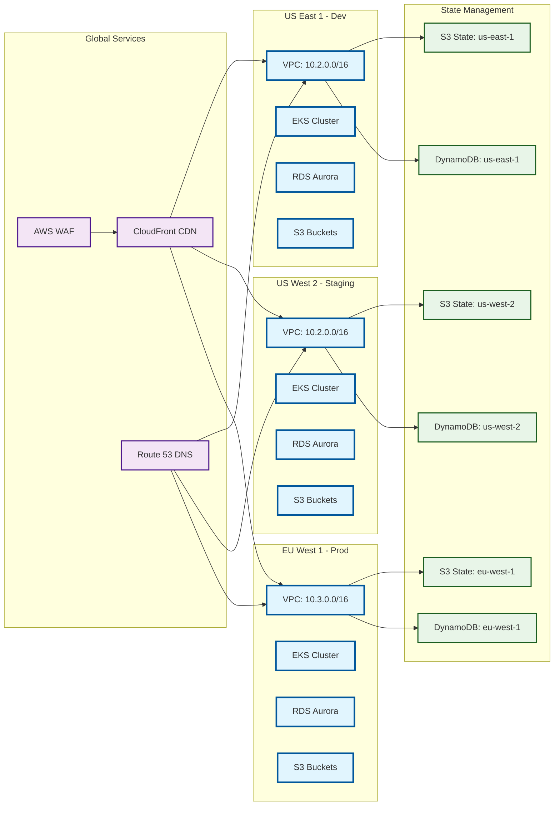

# Network Topology Diagram

Detailed network architecture showing VPC, subnets, and connectivity.

## VPC Network Architecture

```mermaid
graph TB
    subgraph "Internet"
        INTERNET[Internet Gateway]
    end

    subgraph "VPC: 10.2.0.0/16 (Dev/Staging) or 10.3.0.0/16 (Prod)"
        
        subgraph "Public Subnets"
            PUB_A[Public Subnet A<br/>10.x.1.0/24]
            PUB_B[Public Subnet B<br/>10.x.2.0/24]
            PUB_C[Public Subnet C<br/>10.x.3.0/24]
        end

        subgraph "Private Subnets"
            PRIV_A[Private Subnet A<br/>10.x.11.0/24]
            PRIV_B[Private Subnet B<br/>10.x.12.0/24]
            PRIV_C[Private Subnet C<br/>10.x.13.0/24]
        end

        subgraph "Database Subnets"
            DB_A[Database Subnet A<br/>10.x.21.0/24]
            DB_B[Database Subnet B<br/>10.x.22.0/24]
            DB_C[Database Subnet C<br/>10.x.23.0/24]
        end

        subgraph "Load Balancers"
            ALB[Application Load Balancer]
            NLB[Network Load Balancer]
        end

        subgraph "Compute Resources"
            EKS[EKS Cluster]
            FARGATE[Fargate Pods]
        end

        subgraph "Database Resources"
            RDS[RDS Aurora Cluster]
            RDS_READ[RDS Read Replicas]
        end

        subgraph "Storage"
            S3[S3 Buckets]
            EFS[EFS File System]
        end

        subgraph "Security"
            SG_ALB[Security Group: ALB]
            SG_EKS[Security Group: EKS]
            SG_RDS[Security Group: RDS]
            SG_DEFAULT[Security Group: Default]
        end

        subgraph "NAT Gateway"
            NAT[NAT Gateway]
            EIP[Elastic IP]
        end

        subgraph "VPC Endpoints"
            S3_ENDPOINT[S3 VPC Endpoint]
            ECR_ENDPOINT[ECR VPC Endpoint]
            EKS_ENDPOINT[EKS VPC Endpoint]
        end
    end

    %% Internet Connectivity
    INTERNET --> ALB
    INTERNET --> NLB

    %% Public Subnet Connectivity
    ALB --> PUB_A
    ALB --> PUB_B
    ALB --> PUB_C
    NLB --> PUB_A
    NLB --> PUB_B
    NLB --> PUB_C

    %% NAT Gateway Connectivity
    PUB_A --> NAT
    PUB_B --> NAT
    PUB_C --> NAT
    NAT --> EIP
    EIP --> INTERNET

    %% Private Subnet Connectivity
    NAT --> PRIV_A
    NAT --> PRIV_B
    NAT --> PRIV_C

    %% Database Subnet Connectivity
    NAT --> DB_A
    NAT --> DB_B
    NAT --> DB_C

    %% Resource Placement
    EKS --> PRIV_A
    EKS --> PRIV_B
    EKS --> PRIV_C
    FARGATE --> PRIV_A
    FARGATE --> PRIV_B
    FARGATE --> PRIV_C

    RDS --> DB_A
    RDS --> DB_B
    RDS --> DB_C
    RDS_READ --> DB_A
    RDS_READ --> DB_B
    RDS_READ --> DB_C

    %% Security Group Associations
    SG_ALB --> ALB
    SG_EKS --> EKS
    SG_RDS --> RDS
    SG_DEFAULT --> EKS
    SG_DEFAULT --> RDS

    %% VPC Endpoints
    S3_ENDPOINT --> S3
    ECR_ENDPOINT --> EKS
    EKS_ENDPOINT --> EKS

    %% Styling
    classDef publicStyle fill:#e8f5e8,stroke:#2e7d32,stroke-width:2px
    classDef privateStyle fill:#e3f2fd,stroke:#1976d2,stroke-width:2px
    classDef dbStyle fill:#fff3e0,stroke:#f57c00,stroke-width:2px
    classDef resourceStyle fill:#f3e5f5,stroke:#7b1fa2,stroke-width:2px
    classDef securityStyle fill:#ffebee,stroke:#c62828,stroke-width:2px
    classDef natStyle fill:#e0f2f1,stroke:#00695c,stroke-width:2px

    class PUB_A,PUB_B,PUB_C publicStyle
    class PRIV_A,PRIV_B,PRIV_C privateStyle
    class DB_A,DB_B,DB_C dbStyle
    class EKS,FARGATE,RDS,RDS_READ,S3,EFS resourceStyle
    class SG_ALB,SG_EKS,SG_RDS,SG_DEFAULT securityStyle
    class NAT,EIP natStyle
```

## Multi-Region Network Overview

## Security Architecture

```mermaid
graph TB
    subgraph "Security Layers"
        
        subgraph "Network Security"
            NACL[Network ACLs]
            SG[Security Groups]
            WAF[AWS WAF]
        end

        subgraph "Identity & Access"
            IAM[IAM Roles & Policies]
            OIDC[OIDC Provider]
            MFA[MFA Configuration]
        end

        subgraph "Data Protection"
            KMS[KMS Encryption]
            S3_ENCRYPTION[S3 Encryption]
            RDS_ENCRYPTION[RDS Encryption]
            EBS_ENCRYPTION[EBS Encryption]
        end

        subgraph "Monitoring & Logging"
            CLOUDTRAIL[CloudTrail]
            VPC_FLOW[VPC Flow Logs]
            CLOUDWATCH[CloudWatch]
            CONFIG[AWS Config]
        end

        subgraph "Compliance"
            GUARDDUTY[GuardDuty]
            INSPECTOR[Inspector]
            SECURITY_HUB[Security Hub]
        end
    end

    subgraph "Infrastructure"
        VPC[VPC]
        EKS[EKS Cluster]
        RDS[RDS Database]
        S3[S3 Buckets]
    end

    %% Security associations
    NACL --> VPC
    SG --> EKS
    SG --> RDS
    WAF --> VPC

    IAM --> EKS
    IAM --> RDS
    OIDC --> EKS
    MFA --> IAM

    KMS --> RDS
    KMS --> S3
    S3_ENCRYPTION --> S3
    RDS_ENCRYPTION --> RDS
    EBS_ENCRYPTION --> EKS

    CLOUDTRAIL --> VPC
    VPC_FLOW --> VPC
    CLOUDWATCH --> EKS
    CLOUDWATCH --> RDS
    CONFIG --> VPC

    GUARDDUTY --> VPC
    INSPECTOR --> EKS
    SECURITY_HUB --> VPC

    classDef securityStyle fill:#ffebee,stroke:#c62828,stroke-width:2px
    classDef dataStyle fill:#e8f5e8,stroke:#2e7d32,stroke-width:2px
    classDef monitorStyle fill:#e3f2fd,stroke:#1976d2,stroke-width:2px
    classDef infraStyle fill:#f3e5f5,stroke:#7b1fa2,stroke-width:2px

    class NACL,SG,WAF,IAM,OIDC,MFA securityStyle
    class KMS,S3_ENCRYPTION,RDS_ENCRYPTION,EBS_ENCRYPTION dataStyle
    class CLOUDTRAIL,VPC_FLOW,CLOUDWATCH,CONFIG,GUARDDUTY,INSPECTOR,SECURITY_HUB monitorStyle
    class VPC,EKS,RDS,S3 infraStyle
```

## Key Network Features

- **Multi-AZ Deployment**: High availability across availability zones
- **Public/Private Subnets**: Secure network segmentation
- **NAT Gateway**: Outbound internet access for private resources
- **VPC Endpoints**: Private connectivity to AWS services
- **Security Groups**: Stateful firewall rules
- **Network ACLs**: Additional network-level security
- **Load Balancers**: Application and network load balancing
- **Encryption**: Data encryption in transit and at rest
- **Monitoring**: Comprehensive logging and monitoring
