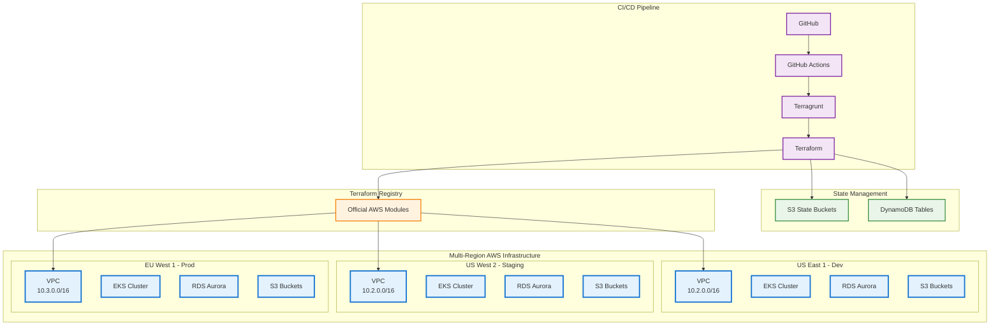
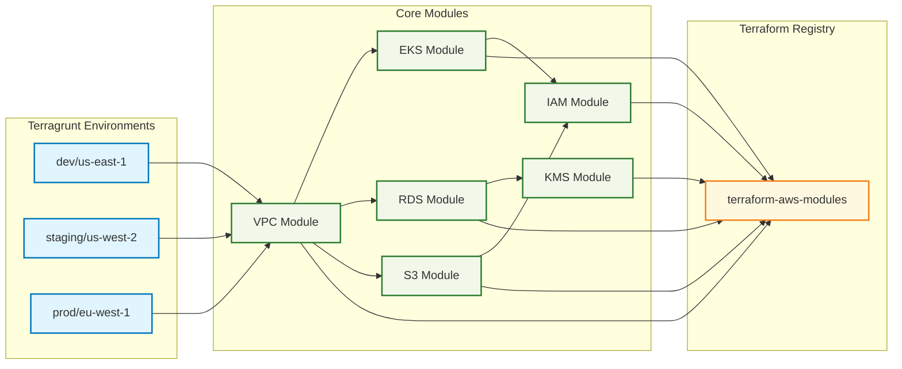
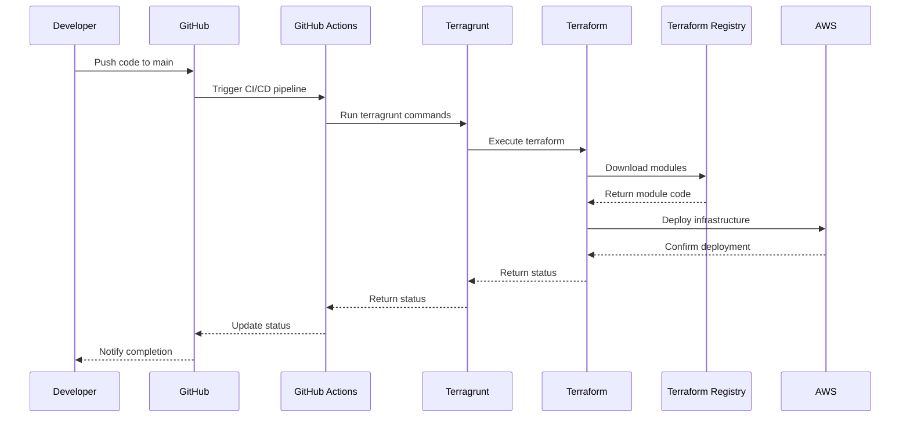

# Simple Terragrunt AWS Infrastructure Diagram

A simplified view of the terragrunt-aws infrastructure architecture.

## Core Infrastructure Overview

## Module Dependencies

## Deployment Flow

## Key Components

- **3 AWS Regions**: us-east-1, us-west-2, eu-west-1
- **3 Environments**: dev, staging, prod
- **Terraform Registry**: All modules from official AWS modules
- **State Management**: S3 + DynamoDB for locking
- **CI/CD**: GitHub Actions automation
- **Infrastructure**: VPC, EKS, RDS, S3, IAM, KMS
